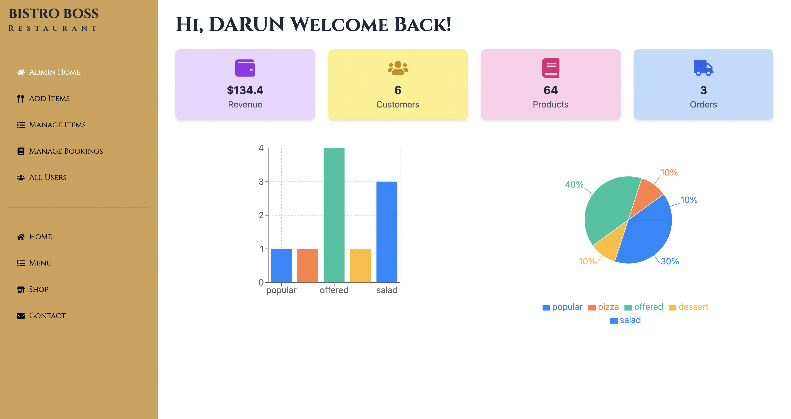
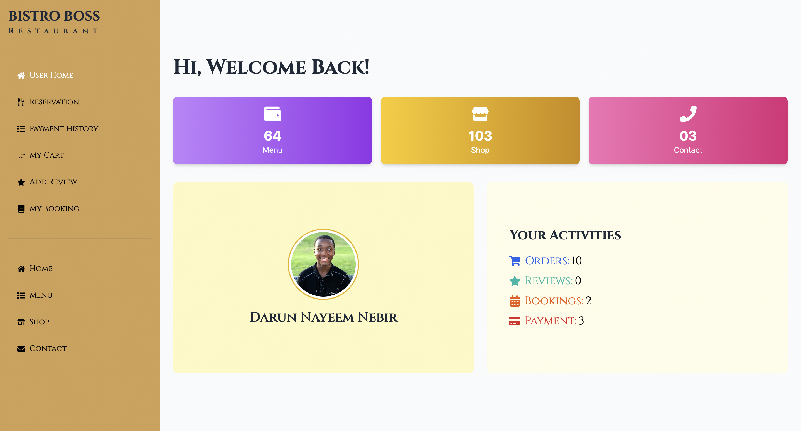

# Bistro✨Boss

Bistro Boss is a comprehensive restaurant management platform designed to streamline operations for restaurants of all sizes. Built using the MERN stack (MongoDB, Express.js, React with Vite, and Node.js) along with a suite of modern web technologies, Bistro Boss delivers an intuitive interface to manage reservations, orders, menus, staff, payments, and analytics.

---

## Features

### Core Features:
- **User Authentication**:
  - Secure login and registration with JWT-based authentication.
  - Password hashing using Bcrypt.js.
  - Role-based access control for Admin, Staff, and Customers.

- **Reservation Management**:
  - Real-time reservation management with time slots, customer details, and table assignments.
  - Real-time updates for better coordination.

- **Order Management**:
  - Efficient order tracking and management with status updates (new, preparing, ready for pickup/delivery).

- **Menu Management**:
  - Dynamic menu updates, including adding, editing, and removing items.
  - Integration with Cloudinary for rich image uploads.

- **Staff Management**:
  - Manage roles, schedules, and track staff performance metrics.

- **Admin Dashboard**:
  - Centralized dashboard for owners to monitor reservations, orders, payments, and staff activities.

- **Email Notifications**:
  - Automated emails for reservations, order updates, payment receipts, and promotional offers using Nodemailer.

- **Payment Integration**:
  - Secure online payments with Stripe, supporting refunds and invoices.

- **Customer Management**:
  - Maintain detailed customer profiles, including order history and favorite menu items.

- **Analytics Dashboard**:
  - Visualize key metrics like sales, orders, and staff performance using Chart.js or Recharts.

- **Real-Time Order Tracking**:
  - Customers and staff receive live order updates through Socket.IO.

- **Multi-Language Support**:
  - Localized interfaces with libraries like `react-i18next`.

- **Mobile-First Design**:
  - Fully responsive design for optimal performance on mobile devices.

---

## Tools & Technology

### Frontend:
- React, Vite
- Redux
- React Router
- Axios
- Tailwind CSS, DaisyUI
- React Toastify
- React Hook Form, Formik
- TanStack Query
- Framer Motion
- Custom React Hooks
- React Icons

### Backend:
- Node.js, Express.js
- MongoDB, Mongoose
- JWT Authentication
- Nodemailer
- Bcrypt.js
- Stripe for payment processing
- Socket.IO for real-time updates
- Cloudinary for image storage
- Multer for file uploads
- Redis for caching

### Design Tools:
- Figma
- Adobe XD
- Sketch

### Hosting:
- Frontend: Netlify, Vercel, Firebase Hosting
- Backend: Heroku, Vercel, AWS S3

---

## Live Links

- **Live Website**: [Bistro Boss Website](https://bistroboss-c5b6e.web.app/)
- **Live Server**: [Bistro Boss Server](https://bistro-boss-server-phi-two.vercel.app/)

---

## Installation and Setup

To get started with Bistro Boss, follow the instructions below.

### Prerequisites:
- Node.js (v16 or above)
- MongoDB (local or cloud instance)
- A modern web browser

### Backend Setup:

1. Clone the server repository:
   ```bash
   git clone <server-repo-url>
   cd server
   ```

2. Install dependencies:
   ```bash
   npm install
   ```

3. Set up environment variables:
   Create a `.env` file in the root directory and add the following:
   ```env
   PORT=5000
   MONGO_URI=<your-mongo-db-uri>
   JWT_SECRET=<your-jwt-secret>
   STRIPE_SECRET_KEY=<your-stripe-secret-key>
   CLOUDINARY_CLOUD_NAME=<your-cloud-name>
   CLOUDINARY_API_KEY=<your-api-key>
   CLOUDINARY_API_SECRET=<your-api-secret>
   ```

4. Start the server:
   ```bash
   npm start
   ```

5. The backend will be accessible at `http://localhost:5000`.

### Frontend Setup:

1. Clone the client repository:
   ```bash
   git clone <client-repo-url>
   cd client
   ```

2. Install dependencies:
   ```bash
   npm install
   ```

3. Set up environment variables:
   Create a `.env` file in the root directory and add the following:
   ```env
   VITE_API_URL=http://localhost:5000
   ```

4. Start the development server:
   ```bash
   npm run dev
   ```

5. The frontend will be accessible at `http://localhost:5173`.

---

## Features Overview

### User Interface
- **Landing Page**:
  - Engaging design to attract customers.
  - Dynamic content showcasing the latest offers and menu items.

- **Reservation System**:
  - Seamlessly book reservations with available time slots.

- **Order Management**:
  - Interactive UI for tracking order status in real-time.

- **Admin Panel**:
  - Centralized control for managing the restaurant's operations.

### Backend Functionality
- **APIs**:
  - RESTful endpoints for reservations, orders, menus, and staff management.

- **Security**:
  - Role-based access control.
  - Encrypted user data.

- **Performance Optimization**:
  - Redis caching for frequently accessed data.
  - Efficient query optimization with Mongoose.

### Real-Time Features
- **Socket.IO**:
  - Real-time order tracking and status updates.

- **Push Notifications**:
  - Notify customers about order updates and promotional offers.

---

## Landing Page Structure

Below is the layout of the landing page:


Admin Dashboard



User Dashboard



---

## Contributing

Contributions are welcome! To contribute:
1. Fork the repository.
2. Create a new branch (`git checkout -b feature/new-feature`).
3. Commit your changes (`git commit -m 'Add a new feature'`).
4. Push to the branch (`git push origin feature/new-feature`).
5. Open a pull request.

---

## License

This project is licensed under the MIT License. See the LICENSE file for details.

---

## Contact

For questions or collaboration, feel free to reach out:
- **Email**: darun15-14188@diu.edu.bd
- **LinkedIn**: [My LinkedIn Profile](https://linkedin.com/in/darunkaras)

---

Thank you for exploring Bistro Boss! Bon appétit! 🍽